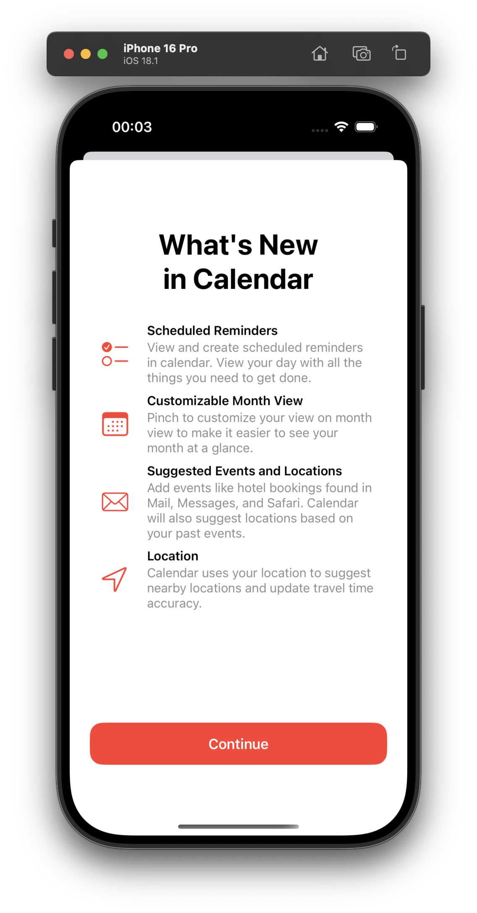
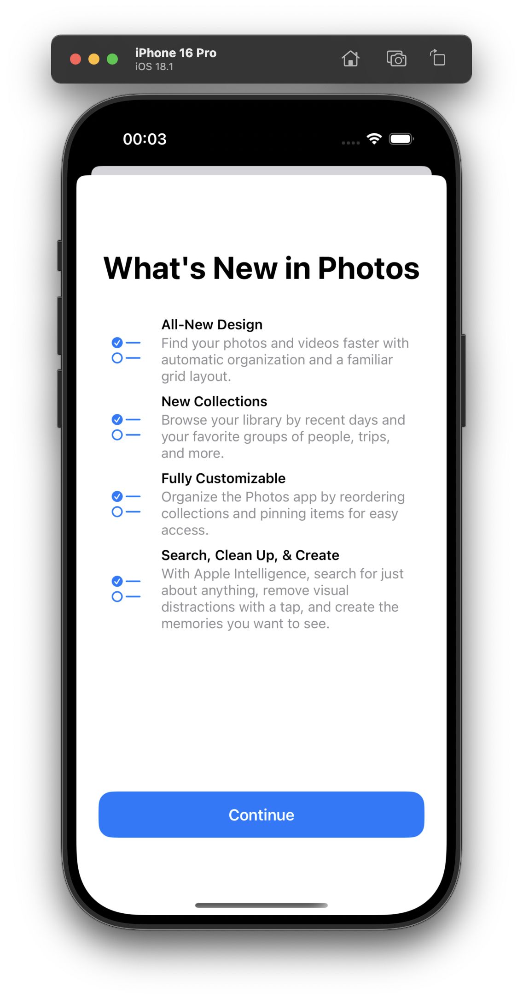

# WhatsNewComponent

SwiftUI view to present iOS-like "What's new" views

|  |  |
| ---------------------------------------- | ---------------------------------------- |

---

## Usage

### Creating a "What's New" Screen

Use `WhatsNewView` to create a "What's New" screen:

```swift
WhatsNewView(title: "Title") { 
    Text("content")
} button: { 
    Button("Button") {
        // Button action here
    }
}
```

### Adding Paragraphs to Content

Use `ParagraphView` to add styled paragraphs as content inside `WhatsNewView`:

```swift
ParagraphView(title: "Title", subtitle: "Subtitle") { 
    Circle()
        .frame(width: 30, height: 30)
}
```

---

## Customization

Explore parameters in initializers to customize the appearance of `WhatsNewView` and `ParagraphView`.
